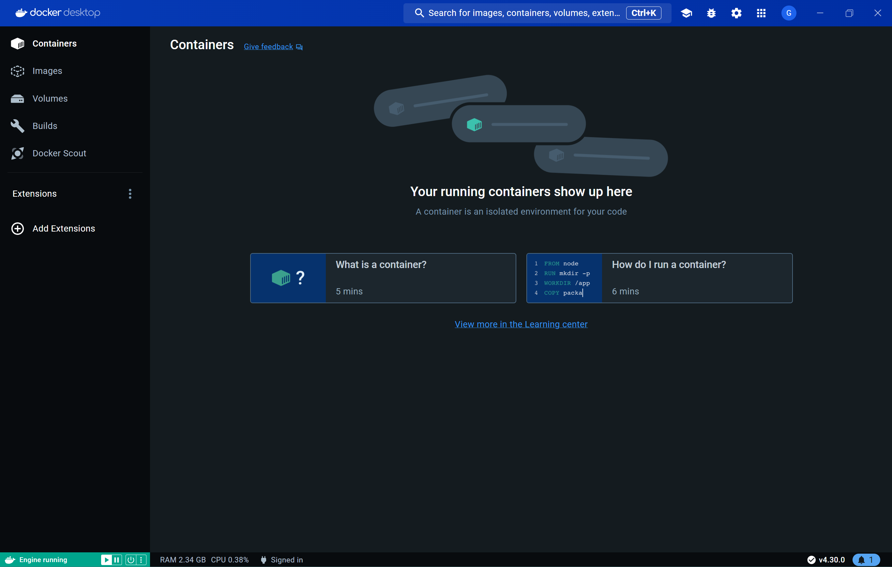
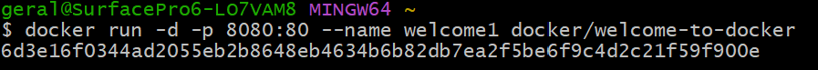
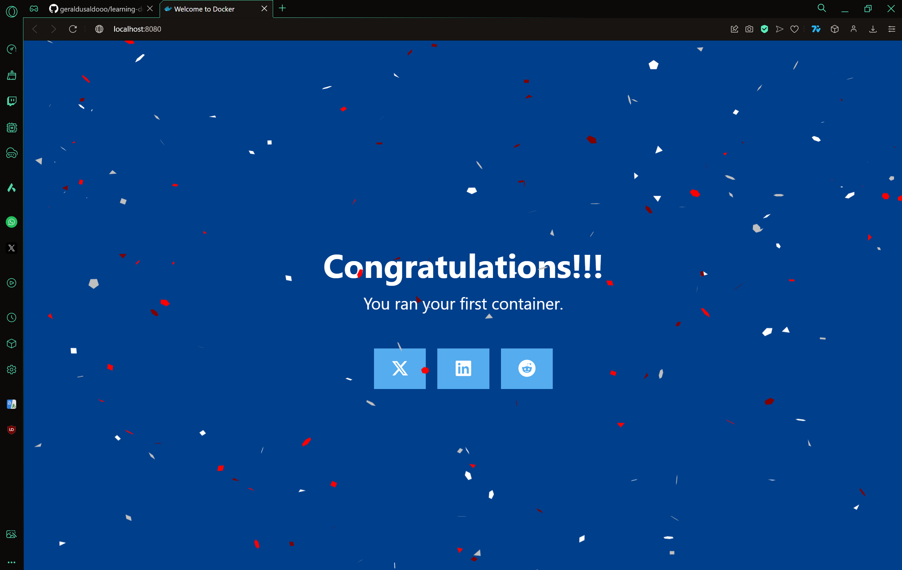
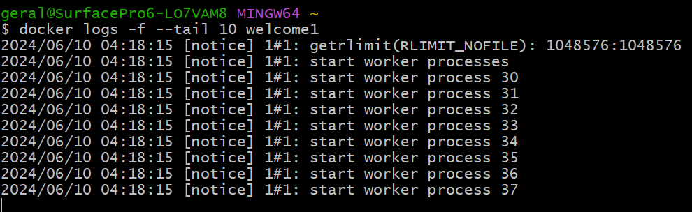
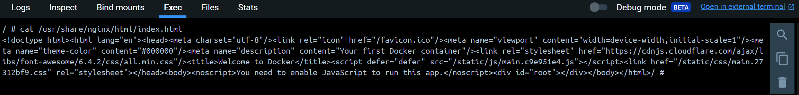
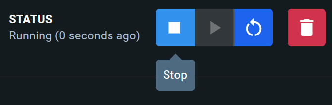
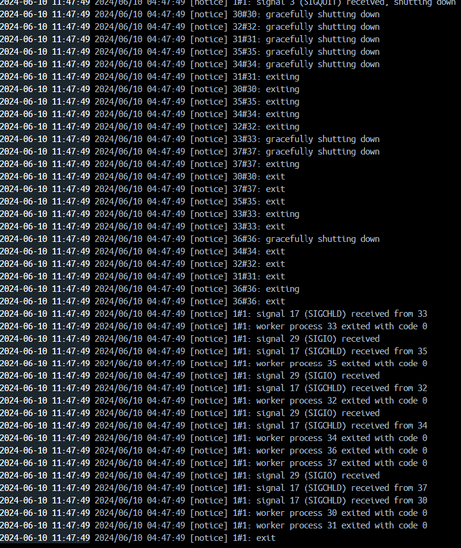

# learning-docker

## Task is running existing docker image [welcome-to-docker](https://hub.docker.com/r/docker/welcome-to-docker) as a container

### First off is to install [Docker Desktop](https://docs.docker.com/desktop/install/windows-install/)

After installing Docker Desktop it should look like this.

### Running the existing container (welcome-to-docker) using command prompt or git bash.

Then when opening localhost with the specified port (8080) it should look like the image below.

### Looking at the logs of running server

### Now executing command inside the Docker container, for example a cat function

### To stop the container we can use the stop button located on the right corner of Docker Desktop

### What the logs look like during the shutting down process

