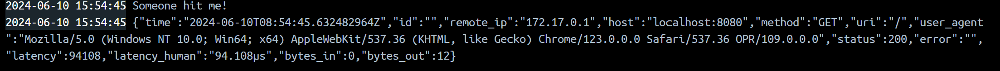

# learning-docker

## Learning Docker by using existing [docker image](https://hub.docker.com/r/docker/welcome-to-docker)

### Installing [Docker Desktop](https://docs.docker.com/desktop/install/windows-install/)

Installed Docker Desktop should look like this.

### Running Docker image

-p 8080:80 means host is at port 8080, local is at host 80
--name shows what is the name of the container

### Checking localhost on the specified port

### Showing the logs of the current running container

### Executing command cat to show the files inside

### Stopping server using the stop button on the top right corner

### Logs during shutting down

## Building Docker file from GO file

### Building dockerfile

### Naming the container and changing the host port

### Log when running the dockerfile

### Running the localhost port, writing dependant on the string written in main.go file

### When the web is opened, it will show another log

